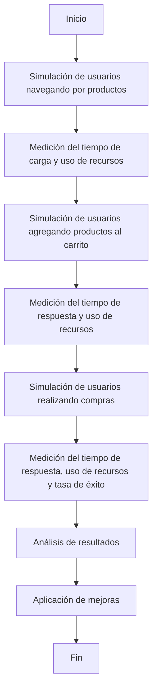

# Unidad: Tests de rendimiento

## Introducción a la unidad y objetivos de aprendizaje

En esta unidad, nos enfocaremos en los tests de rendimiento, una parte crucial del proceso de desarrollo de software que asegura que nuestra aplicación web, en este caso un sistema de carrito de compras desarrollado con Django, funcione de manera eficiente bajo diversas condiciones de carga. Los tests de rendimiento nos permiten identificar cuellos de botella y optimizar el rendimiento antes de que los usuarios finales experimenten problemas.

### Objetivos de aprendizaje

1. Comprender la importancia de los tests de rendimiento en el desarrollo de aplicaciones web.
2. Aprender a diseñar y ejecutar tests de rendimiento utilizando herramientas específicas.
3. Implementar tests de rendimiento en un sistema de carrito de compras con Django.
4. Analizar los resultados de los tests de rendimiento y aplicar mejoras basadas en estos resultados.
5. Conocer las mejores prácticas y consideraciones de diseño para optimizar el rendimiento de aplicaciones web.

## Documento funcional de requerimientos

### Descripción detallada de la funcionalidad

Los tests de rendimiento se centran en evaluar cómo se comporta el sistema bajo diferentes condiciones de carga. Para nuestro sistema de carrito de compras, esto implica simular múltiples usuarios realizando diversas acciones como navegar por productos, agregar productos al carrito, y realizar compras. Los tests de rendimiento deben medir métricas clave como el tiempo de respuesta, el uso de CPU y memoria, y la tasa de errores.

### Casos de uso

1. **Simulación de múltiples usuarios navegando por productos**:
   - Usuarios concurrentes acceden a la página de listado de productos.
   - Medición del tiempo de carga de la página y uso de recursos.

2. **Simulación de usuarios agregando productos al carrito**:
   - Usuarios concurrentes seleccionan productos y los agregan al carrito.
   - Medición del tiempo de respuesta y uso de recursos durante la operación.

3. **Simulación de usuarios realizando compras**:
   - Usuarios concurrentes completan el proceso de compra.
   - Medición del tiempo de respuesta, uso de recursos y tasa de éxito de las transacciones.

### Diagramas de flujo (en mermaid)



### Requisitos no funcionales

1. **Escalabilidad**: Los tests deben ser capaces de simular un número creciente de usuarios para evaluar cómo escala la aplicación.
2. **Reproducibilidad**: Los tests deben ser reproducibles para permitir comparaciones entre diferentes ejecuciones.
3. **Automatización**: Los tests deben ser automatizables para integrarse en el pipeline de CI/CD.
4. **Reportabilidad**: Los resultados de los tests deben ser fácilmente interpretables y presentables en forma de informes.

## Implementación en Python

### Explicación paso a paso del código

Para implementar tests de rendimiento en nuestro sistema de carrito de compras con Django, utilizaremos la herramienta `Locust`, que es una herramienta de carga distribuida y de código abierto que permite definir el comportamiento de los usuarios en Python.

#### Instalación de Locust

Primero, necesitamos instalar Locust. Esto se puede hacer fácilmente utilizando `pip`:

```bash
pip install locust
```

#### Definición de los tests de rendimiento

Crearemos un archivo llamado `locustfile.py` en el directorio raíz de nuestro proyecto Django. Este archivo contendrá la definición de los tests de rendimiento.

1. **Importaciones y configuración inicial**:
   ```python
   from locust import HttpUser, TaskSet, task, between

   class WebsiteTasks(TaskSet):
       @task(1)
       def index(self):
           self.client.get("/")

       @task(2)
       def view_product(self):
           self.client.get("/product/1/")

       @task(3)
       def add_to_cart(self):
           self.client.post("/cart/add/", {"product_id": 1, "quantity": 1})

       @task(4)
       def checkout(self):
           self.client.post("/checkout/", {"address": "123 Main St", "payment_method": "card"})

   class WebsiteUser(HttpUser):
       tasks = [WebsiteTasks]
       wait_time = between(1, 5)
   ```

2. **Explicación del código**:
   - **Importaciones**: Importamos las clases y funciones necesarias de Locust.
   - **WebsiteTasks**: Definimos una clase `WebsiteTasks` que hereda de `TaskSet`. Esta clase contiene las tareas que los usuarios realizarán.
     - **index**: Simula la navegación a la página principal.
     - **view_product**: Simula la visualización de un producto específico.
     - **add_to_cart**: Simula la acción de agregar un producto al carrito.
     - **checkout**: Simula el proceso de compra.
   - **WebsiteUser**: Definimos una clase `WebsiteUser` que hereda de `HttpUser`. Esta clase representa a un usuario que realiza las tareas definidas en `WebsiteTasks`. La propiedad `wait_time` define el tiempo de espera entre tareas.

### Código fuente completo y comentado

```python
from locust import HttpUser, TaskSet, task, between

class WebsiteTasks(TaskSet):
    @task(1)
    def index(self):
        """
        Simula la navegación a la página principal.
        """
        self.client.get("/")

    @task(2)
    def view_product(self):
        """
        Simula la visualización de un producto específico.
        """
        self.client.get("/product/1/")

    @task(3)
    def add_to_cart(self):
        """
        Simula la acción de agregar un producto al carrito.
        """
        self.client.post("/cart/add/", {"product_id": 1, "quantity": 1})

    @task(4)
    def checkout(self):
        """
        Simula el proceso de compra.
        """
        self.client.post("/checkout/", {"address": "123 Main St", "payment_method": "card"})

class WebsiteUser(HttpUser):
    tasks = [WebsiteTasks]
    wait_time = between(1, 5)
```

### Ejemplos de uso y pruebas unitarias

Para ejecutar los tests de rendimiento, utilizamos el siguiente comando en la terminal:

```bash
locust -f locustfile.py
```

Esto iniciará una interfaz web en `http://localhost:8089` donde podemos configurar el número de usuarios simulados y la tasa de generación de usuarios.

#### Ejemplo de configuración:

- **Número de usuarios simulados**: 100
- **Tasa de generación de usuarios**: 10 usuarios por segundo

Al iniciar la prueba, Locust comenzará a simular los usuarios realizando las tareas definidas y mostrará métricas en tiempo real como el tiempo de respuesta, el número de solicitudes por segundo, y la tasa de errores.

### Análisis de resultados

Una vez finalizada la prueba, Locust proporciona un informe detallado con las métricas recopiladas. Es importante analizar estos resultados para identificar posibles cuellos de botella y áreas de mejora. Por ejemplo, si el tiempo de respuesta para agregar productos al carrito es significativamente mayor que el tiempo de respuesta para navegar por productos, esto podría indicar un problema en la lógica de agregación al carrito que necesita ser optimizado.

## Mejores prácticas y consideraciones de diseño

1. **Planificación de pruebas**: Antes de ejecutar los tests de rendimiento, es crucial definir claramente los objetivos y las métricas que se desean evaluar. Esto incluye identificar las rutas críticas de la aplicación y los escenarios de uso más comunes.

2. **Simulación realista**: Asegúrate de que los tests simulen de manera realista el comportamiento de los usuarios. Esto incluye variar los tiempos de espera entre acciones y simular diferentes tipos de usuarios con distintos patrones de uso.

3. **Automatización**: Integra los tests de rendimiento en el pipeline de CI/CD para que se ejecuten automáticamente en cada despliegue. Esto ayuda a identificar problemas de rendimiento de manera temprana y continua.

4. **Monitoreo y alertas**: Implementa herramientas de monitoreo y alertas para detectar problemas de rendimiento en tiempo real. Esto permite una respuesta rápida a problemas que puedan surgir en producción.

5. **Optimización iterativa**: Utiliza los resultados de los tests de rendimiento para realizar optimizaciones iterativas. Esto incluye ajustar la configuración del servidor, optimizar consultas a la base de datos, y mejorar la eficiencia del código.

6. **Documentación**: Documenta los resultados de los tests de rendimiento y las optimizaciones realizadas. Esto facilita la comprensión del historial de rendimiento de la aplicación y ayuda en la toma de decisiones futuras.

### Consideraciones sobre seguridad, rendimiento y escalabilidad

- **Seguridad**: Asegúrate de que los tests de rendimiento no comprometan la seguridad de la aplicación. Esto incluye evitar la exposición de datos sensibles y asegurar que los endpoints utilizados en las pruebas estén protegidos adecuadamente.

- **Rendimiento**: Optimiza el código y la infraestructura para manejar la carga esperada. Esto puede incluir el uso de cachés, balanceadores de carga, y optimización de consultas a la base de datos.

- **Escalabilidad**: Diseña la aplicación para escalar horizontalmente, permitiendo agregar más servidores para manejar una mayor carga. Los tests de rendimiento deben incluir escenarios de escalabilidad para evaluar cómo se comporta la aplicación bajo una carga creciente.

### Consejos para la depuración y solución de problemas comunes

1. **Identificación de cuellos de botella**: Utiliza las métricas de los tests de rendimiento para identificar cuellos de botella en la aplicación. Esto puede incluir tiempos de respuesta elevados, alto uso de CPU o memoria, y tasas de error elevadas.

2. **Optimización de consultas a la base de datos**: Las consultas a la base de datos son a menudo una fuente de problemas de rendimiento. Utiliza herramientas de perfilado para identificar consultas lentas y optimizarlas.

3. **Uso de cachés**: Implementa cachés para reducir la carga en la base de datos y mejorar los tiempos de respuesta. Esto puede incluir el uso de cachés en memoria como Redis o Memcached.

4. **Balanceo de carga**: Utiliza balanceadores de carga para distribuir la carga entre múltiples servidores. Esto ayuda a mejorar la disponibilidad y el rendimiento de la aplicación.

5. **Monitoreo continuo**: Implementa herramientas de monitoreo para realizar un seguimiento continuo del rendimiento de la aplicación. Esto ayuda a detectar problemas de manera proactiva y tomar medidas correctivas antes de que afecten a los usuarios finales.

En resumen, los tests de rendimiento son una parte esencial del proceso de desarrollo de software que nos permite asegurar que nuestra aplicación funcione de manera eficiente bajo diversas condiciones de carga. Al seguir las mejores prácticas y utilizar herramientas adecuadas, podemos identificar y resolver problemas de rendimiento de manera efectiva, asegurando una experiencia de usuario óptima.